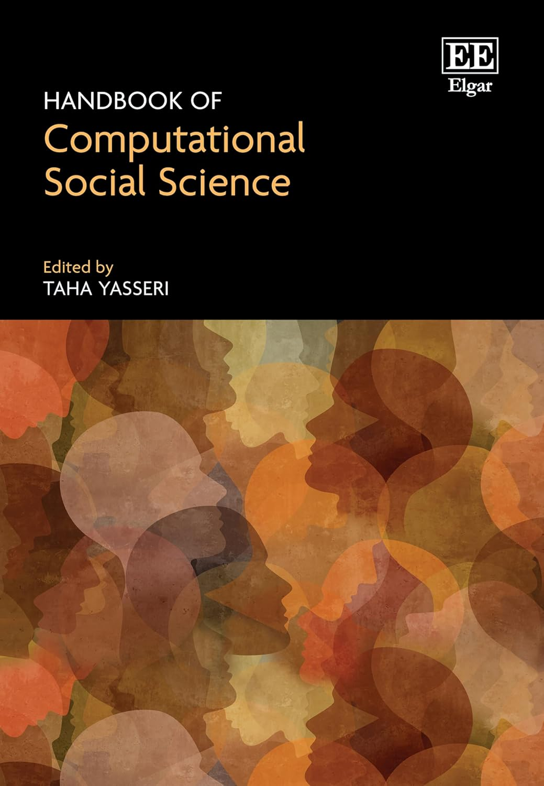
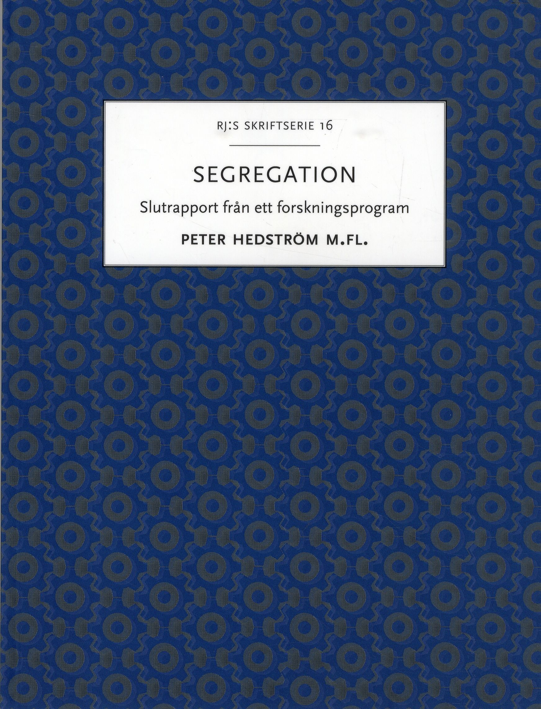

::: {.page-hero}
# Publications
:::

## Journal Articles

::: {.publication-list}
::: {.content-card .publication-card .publication-item}
::: {.content-card-body}

::: {.content-card-eyebrow}
2025 • Journal Article
:::

### Kin Propinquity, Residential Mobility, and the Persistence of Segregation

::: {.content-card-byline}
Benjamin F. Jarvis, Guilherme Kenji Chihaya, and Eduardo Tapia
:::

::: {.content-card-description}
This article presents an analysis of the relationship between kin propinquity, residential mobility, and the persistence of segregation among ancestry groups living in Stockholm, Sweden. Residential segregation between Swedish and non-Swedish ancestry groups is established when immigrants first settle in Stockholm, which creates disparities in the spatial distribution of kin for the children of immigrants compared with their Swedish counterparts. Using agent-based models, we show how preferences to live near kin are sufficient to maintain existing segregation but are not sufficient to generate it. We then apply discrete choice models of residential mobility to longitudinal residential history data from Swedish population registers to estimate the effects of kin on the neighborhood choices of movers, ages 18‒30, during the 1998‒2017 period. We find that people are more likely to move to neighborhoods that are near to kin, net of controls for sorting by ancestry, socioeconomic status, and life course characteristics. Counterfactual simulations of residential mobility show that kin propinquity contributes to higher levels of segregation between Swedish and non-Swedish ancestry groups. These effects are larger for groups already experiencing high levels of segregation from the Swedish majority. We situate these findings in the emerging literature on social structural sorting.
:::

::: {.content-card-detail .publication-footer}
::: {.publication-links}
[Demography](https://doi.org/10.1215/00703370-12347377)
:::
:::

:::
:::

::: {.content-card .publication-card .publication-item}
::: {.content-card-body}

::: {.content-card-eyebrow}
2025 • Journal Article
:::

### The effect of school peers on residential mobility in young adulthood: evidence from Sweden

::: {.content-card-byline}
Laura Fürsich and Benjamin F Jarvis
:::

::: {.content-card-description}
There is increasing evidence that social networks matter not only for long-distance moves but also for short-distance residential mobility. And the emerging structural sorting perspective is integrating networks into understandings of segregation processes. We add to this literature by considering how former school peers influence residential choices. We use Swedish register data describing the residential histories of cohorts of students who attended the same primary or secondary schools in Sweden. We trace their residential choices in young adulthood and estimate the effect of distance to peers on these choices. To account for selection, we use the spatial configuration of older cohorts who attended the same schools to adjust for peer similarity on unobserved preferences and attitudes. Using conditional logistic regression models of residential destinations, we find that individuals are more likely to choose a neighbourhood close to former school peers. Drawing on a linked lives perspective, we also consider how the peer effects change over the early adult life-course. The models imply that other networks can displace the social influence of primary and secondary school peers. While our analysis does not consider segregation as an outcome, our results suggest that schools may play a role in reproducing patterns of segregation within and between generations.
:::

::: {.content-card-detail .publication-footer}
::: {.publication-links}
[European Sociological Review](https://doi.org/10.1093/esr/jcaf002)
:::
:::

:::
:::

::: {.content-card .publication-card .publication-item}
::: {.content-card-body}

::: {.content-card-eyebrow}
2025 • Journal Article
:::

### Exogamy, Proximity to Parents, and the Residential Choices of 1.5- and Second-Generation Immigrants in Sweden

::: {.content-card-byline}
Benjamin F. Jarvis and Jenjira J. Yahirun
:::

::: {.content-card-description}
Living near kin facilitates intergenerational support, which may be especially important for immigrant families. For 1.5- and second-generation immigrants, this creates a tension between residential integration and family obligations. This tension can grow when forming a union, particularly with a nonimmigrant. Yet little is known about how residential moves for partnered immigrants shape and are shaped by proximity to parents. Using Swedish register data from 1990 to 2017, we examine the settlement patterns and residential choices of (1) endogamous immigrant couples where partners have the same national background, (2) exogamous couples featuring one immigrant and one nonimmigrant partner, and (3) endogamous unions with two nonimmigrant Swedish partners. Descriptive statistics show that endogamous immigrants are most likely to be living near their parents, followed by exogamous immigrants, and then endogamous and exogamous Swedes. However, discrete choice models of residential mobility behaviors, which account for the spatial distribution of housing, reveal that all groups are more likely to locate nearer to parents, with only modest differences between them. Across model specifications, the effect of distance to parents for immigrants in exogamous unions is slightly, but consistently, weaker than for their partners or counterparts in other kinds of unions. These findings suggest weaker attachments between exogamous immigrants and their parents, while also underscoring how group differences in proximity to family reflect the uneven geographic distributions of housing and immigrant families in Sweden.
:::

::: {.content-card-detail .publication-footer}
::: {.publication-links}
[Population, Space and Place](https://doi.org/10.1002/psp.70117)
:::
:::

:::
:::

::: {.content-card .publication-card .publication-item}
::: {.content-card-body}

::: {.content-card-eyebrow}
2023 • Journal Article
:::

### Assortative mating, residential choice, and ethnic segregation

::: {.content-card-byline}
Benjamin F. Jarvis, Robert D. Mare, and Monica K. Nordvik
:::

::: {.content-card-description}
This paper presents a study of the relationship between assortative mating and ethnic segregation in Stockholm, Sweden. We examine how segregation influences couple formation, where newly cohabiting couples choose to live, and how union formation and mobility jointly influence residential segregation. 1990–2012 Swedish population registers allow us to identify the onset of cohabiting relationships and residential mobility for newly cohabiting couples. Estimates based on two-sex models of assortative mating and discrete choice models of residential mobility reveal that non-Western ethnic groups are largely confined to non-Western partners and to neighborhoods with disproportionately high representations of non-Western groups. Simulations based on our empirical models indicate that assortative mating and residential mobility both contribute to segregation. Tendencies to partner with singles who live nearby and who share the same ethnicity and nativity increase segregation. The results demonstrate how residential segregation and homogamous patterns of union formation are mutually constitutive and suggest that more attention should be paid to family demography when studying segregation.
:::

::: {.content-card-detail .publication-footer}
::: {.publication-links}
[Research in Social Stratification and Mobility](https://doi.org/10.1016/j.rssm.2023.100809)
:::
:::

:::
:::

::: {.content-card .publication-card .publication-item}
::: {.content-card-body}

::: {.content-card-eyebrow}
2019 • Journal Article
:::

### Estimating Multinomial Logit Models with Samples of Alternatives

::: {.content-card-byline}
Benjamin F. Jarvis
:::

::: {.content-card-description}
This comment reconsiders advice offered by Bruch and Mare regarding sampling choice sets in conditional logistic regression models of residential mobility. Contradicting Bruch and Mare’s advice, past econometric research shows that no statistical correction is needed when using simple random sampling of unchosen alternatives to pare down respondents’ choice sets. Using data on stated residential preferences contained in the Los Angeles portion of the Multi-City Study of Urban Inequality, it is shown that following Bruch and Mare’s advice—to implement a statistical correction for simple random choice set sampling—leads to biased coefficient estimates. This bias is all but eliminated if the sampling correction is omitted.
:::

::: {.content-card-detail .publication-footer}
::: {.publication-links}
[Sociological Methodology](https://doi.org/10.1177/0081175018793460)
:::
:::

:::
:::

::: {.content-card .publication-card .publication-item}
::: {.content-card-body}

::: {.content-card-eyebrow}
2017 • Journal Article
:::

### Impact of ancestry categorisations on residential segregation measures using Swedish register data

::: {.content-card-byline}
Benjamin F. Jarvis, Juta Kawalerowicz, and Sarah Valdez
:::

::: {.content-card-description}
Aim:Country-of-birth data contained in registers are often aggregated to create broad ancestry group categories. We examine how measures of residential segregation vary according to levels of aggregation.Method:We use Swedish register data to calculate pairwise dissimilarity indices from 1990 to 2012 for ancestry groups defined at four nested levels of aggregation: (1) micro-groups containing 50 categories, (2) meso-groups containing 16 categories, (3) macro-groups containing six categories and (4) a broad Western/non-Western binary.Results:We find variation in segregation levels between ancestry groups that is obscured by data aggregation.Conclusions:This study demonstrates that the practice of aggregating country-of-birth statistics in register data can hinder the ability to identify highly segregated groups and therefore design effective policy to remedy both intergroup and intergenerational inequalities.
:::

::: {.content-card-detail .publication-footer}
::: {.publication-links}
[Scandinavian Journal of Public Health](https://doi.org/10.1177/1403494817702341)
:::
:::

:::
:::

::: {.content-card .publication-card .publication-item}
::: {.content-card-body}

::: {.content-card-eyebrow}
2017 • Journal Article
:::

### Rising Intragenerational Occupational Mobility in the United States, 1969 to 2011

::: {.content-card-byline}
Benjamin F. Jarvis and Xi Song
:::

::: {.content-card-description}
Despite the theoretical importance of intragenerational mobility and its connection to intergenerational mobility, no study since the 1970s has documented trends in intragenerational occupational mobility. The present article fills this intellectual gap by presenting evidence of an increasing trend in intragenerational mobility in the United States from 1969 to 2011. We decompose the trend using a nested occupational classification scheme that distinguishes between disaggregated micro-classes and progressively more aggregated meso-classes, macro-classes, and manual and nonmanual sectors. Log-linear analysis reveals that mobility increased across the occupational structure at nearly all levels of aggregation, especially after the early 1990s. Controlling for structural changes in occupational distributions modifies, but does not substantially alter, these findings. Trends are qualitatively similar for men and women. We connect increasing mobility to other macro-economic trends dating back to the 1970s, including changing labor force composition, technologies, employment relations, and industrial structures. We reassert the sociological significance of intragenerational mobility and discuss how increasing variability in occupational transitions within careers may counteract or mask trends in intergenerational mobility, across occupations and across more broadly construed social classes.
:::

::: {.content-card-detail .publication-footer}
::: {.publication-links}
[American Sociological Review](https://doi.org/10.1177/0003122417706391)
:::
:::

:::
:::
:::

## Books & Book Chapters

::: {.publication-list}
::: {.content-card .publication-card .publication-item .has-media}
::: {.content-card-media .publication-media}

:::

::: {.content-card-body}

::: {.content-card-eyebrow}
2025 • Book Chapter
:::

### On the intersection of analytical sociology and computational social science

::: {.content-card-byline}
Martin Arvidsson, Peter Hedström, Benjamin F. Jarvis, and Marc Keuschnigg
:::

::: {.content-card-description}
Analytical sociology is concerned with mechanism-based explanations of collective phenomena in socially interdependent systems. Social interdependencies make identifying the processes that generate collective outcomes a challenging task, however, and their study typically requires research designs that differ from those traditionally used by sociologists. The availability of time-stamped networked datasets, the rapid progress in computational power, and the development of new methodological tools in the field of computational social science have enabled detailed analyses of large populations of interacting individuals in different social environments. This has in turn opened the door to detailed, empirically grounded investigations of the microlevel dynamics that give rise to macrolevel phenomena. These advances are important because they help close the gap between theoretical and empirical work in sociology in ways that should be instructive for the field of computational social science.
:::

::: {.content-card-detail .publication-footer}
::: {.publication-links}
[Handbook of Computational Social Science](https://doi.org/10.4337/9781802207309.00011)
:::
:::

:::
:::

::: {.content-card .publication-card .publication-item .has-media}
::: {.content-card-media .publication-media}

:::

::: {.content-card-body}

::: {.content-card-eyebrow}
2021 • Book Chapter
:::

### Analytical sociology amidst a computational social science revolution

::: {.content-card-byline}
Benjamin F. Jarvis, Marc Keuschnigg, and Peter Hedström
:::

::: {.content-card-description}
Analytical sociology is beginning to embrace a digital revolution in the collection and analysis of social data and is increasingly drawing on tools from computational social science (CSS) to pursue its goals of mechanism-based explanation of aggregate outcomes. In this chapter, we highlight the ways in which analytical sociologists are using CSS tools to further social research. Using agent-based modeling, large-scale online experiments, digital trace data, and natural language processing, analytical sociologists are identifying how large-scale properties of social systems emerge from the complex interactions of networked actors at lower scales. At the same time, we provide a perspective on how CSS techniques can be successfully deployed in social research, including ways in which they can be productively combined. Computational tools, when applied using a theory-grounded approach, offer sociologists a chance to transcend the limitations of the dominant survey-research paradigm and finally address “big” sociological questions about, for example, the nature of culture, the emergence of inequality, and the dynamics of segregation. We also discuss how computational social scientists can take cues from analytical sociology to further hone their own research and methods in the service of theoretically grounded, mechanism-based explanations, moving beyond theoretically thin descriptions or predictions of micro- and macro-level outcomes.
:::

::: {.content-card-detail .publication-footer}
::: {.publication-links}
[Handbook of Computational Social Science](https://doi.org/10.4324/9781003024583)
:::
:::

:::
:::

::: {.content-card .publication-card .publication-item .has-media}
::: {.content-card-media .publication-media}

:::

::: {.content-card-body}

::: {.content-card-eyebrow}
2019 • Book Chapter
:::

### Förfäder, tillhörigheter och selektiv parbildning: Sociala bindningar som segregationsbevarande mekanismer

::: {.content-card-byline}
Benjamin F. Jarvis
:::

::: {.content-card-description}
Forskningsprogrammet Segregation: Mikromekanismer och makrodynamik tilldelades anslag av Stiftelsen Riksbankens Jubileumsfond 2012. Målet var att förstå etnisk och könsmässig segregation i Sverige. Forskarna har analyserat registerdata och genomfört experiment för att se hur och varför arbetsplatser, skolor och grannskap segregeras. De har också utvecklat nya metoder inom analytisk sociologi, ett fält där man undersöker både individers handlande och vad det får för samhälleliga konsekvenser, det vill säga hur mikro- och makrodynamik samverkar. Detta är programmets slutrapport.
:::

::: {.content-card-detail .publication-footer}
::: {.publication-links}
[Segregation: Mikromekanismer och makrodynamik](https://view.publitas.com/riksbankens-jubileumsfond/rj-s-skriftserie-nr-16-2019)
:::
:::

:::
:::
:::

## Works in Progress

::: {.publication-list}
::: {.content-card .publication-card .publication-item}
::: {.content-card-body}

::: {.content-card-eyebrow}
2026 • Working Paper / Preprint
:::

### The Ethnic Reputations of Neighborhoods: A Study of Mainstream and Social Media Discourse in Sweden

::: {.content-card-byline}
Miriam Hurtado Bodell, Benjamin Jarvis, and Selcan Mutgan
:::

::: {.content-card-description}
This study introduces ethnic reputations—collectively constructed associations between specific neighborhoods and ethnic groups—as a distinct dimension of urban symbolic reality. These reputations circulate in public discourse and may guide the race- and ethnicity-based heuristics people use to evaluate places, serving as potential mediators in segregation processes. A key question is whether ethnic reputations correspond to the demographic realities of neighborhoods. We answer this question by applying computational methods to a combination of textual and demographic data. We use word embeddings models to extract ethnic reputation scores for ethnic groups and neighborhoods in Stockholm from articles in Sweden's largest newspaper and posts in its largest online discussion forum between 2010 and 2017. We link these to demographic data from the Swedish population registers, enabling comparisons of ethnic reputations to demographic reality across media environments. We find that ethnic reputations appear in both media environments and follow similar patterns: reputations tend to be stronger for groups perceived as more culturally distant from the Swedish majority, especially in neighborhoods with larger minority populations. However, reputations in social media are more consistent across neighborhoods, groups, and over time compared to mainstream media.  These results show that media discourses contain ethnicized representations of urban space that are accessible to a wider public and only partially reflect demographic realities.
:::

::: {.content-card-detail .publication-footer}
::: {.publication-links}
[SocArXiv](https://doi.org/10.31235/osf.io/4x93e_v1)
:::
:::

:::
:::

::: {.content-card .publication-card .publication-item}
::: {.content-card-body}

::: {.content-card-eyebrow}
2025 • Working Paper / Preprint
:::

### However Far Away? The Spatial Contingencies of Assortative Mating

::: {.content-card-byline}
Jesper Lindmarker and Benjamin F. Jarvis
:::

::: {.content-card-description}
This study reconsiders a classic sociological question: how does space shape intimate ties? Specifically, it examines how the spatial segregation of ethnic groups contributes to patterns of ethnic endogamy. It does so by applying conditional logit models to Swedish population registers describing couples who began cohabiting between 1990 and 2017. The models compare observed unions to counterfactual unions drawn from available singles, distinguishing the effects of ancestry assortativity---based on country of origin---from residential propinquity, while controlling for matching on nativity, education, and age. Proximity strongly predicts partnering, but assortativity matters too, particularly for non-Western groups. Mediation analysis shows that failing to account for propinquity overstates endogamy by 20–40 percent for these groups, with stronger mediation for the most segregated groups. The findings suggest that segregation complements ethnic boundaries in the short term, but also suggest how integration may undermine group boundaries in the longer term.
:::

::: {.content-card-detail .publication-footer}
::: {.publication-links}
[SocArXiv](https://doi.org/10.31235/osf.io/4tq8z_v1)
:::
:::

:::
:::

::: {.content-card .publication-card .publication-item}
::: {.content-card-body}

::: {.content-card-eyebrow}
2024 • Working Paper / Preprint
:::

### Ethnic Preferences in Action? A Discrete Choice Analysis of Apartment Rental Applications

::: {.content-card-byline}
Benjamin F. Jarvis, Maël Lecoursonnais, and Guilherme Kenji Chihaya
:::

:::
:::
:::

## Conference Presentations

::: {.publication-list}
::: {.content-card .publication-card .publication-item}
::: {.content-card-body}

::: {.content-card-eyebrow}
2024 • Talk
:::

### Modeling segregation processes in a hybrid housing market

::: {.content-card-byline}
Benjamin F. Jarvis
:::

::: {.content-card-detail .publication-footer}
::: {.publication-venue}
16th Annual Conference of the International Network of Analytical Sociology
:::
:::

:::
:::

::: {.content-card .publication-card .publication-item}
::: {.content-card-body}

::: {.content-card-eyebrow}
2022 • Conference Presentation
:::

### How do super-local network features shape residential segregation? A modified Schelling model

::: {.content-card-byline}
Laura Fürsich and Benjamin F. Jarvis
:::

::: {.content-card-detail .publication-footer}
::: {.publication-venue}
Sunbelt 2022
:::
:::

:::
:::

::: {.content-card .publication-card .publication-item}
::: {.content-card-body}

::: {.content-card-eyebrow}
2021 • Talk
:::

### Kinship Effects on Couples' Residential Choices: Asymmetries by Gender and Ancestry

::: {.content-card-byline}
Benjamin F. Jarvis
:::

::: {.content-card-detail .publication-footer}
::: {.publication-links}
[Population Association of America 2021 Annual Meeting](https://submissions2.mirasmart.com/PAA2021/ViewSubmissionFile.aspx?sbmID=3409&mode=html&validate=false)
:::
:::

:::
:::

::: {.content-card .publication-card .publication-item}
::: {.content-card-body}

::: {.content-card-eyebrow}
2018 • Conference Presentation
:::

### Assortative Mating and Residential Segregation of Ancestry Groups in Stockholm

::: {.content-card-byline}
Benjamin F. Jarvis, Robert D. Mare, and Monica K. Nordvik
:::

::: {.content-card-description}
This paper presents a combined analysis of assortative mating and neighborhood residential segregation of ancestry and immigrant status groups in Stockholm. We develop a model that includes the effects of segregation on couple formation, the residential choices of newly cohabiting couples who vary in ancestry and place of residence prior to cohabitation, and the combined effects of these processes on residential segregation. We use Swedish population register data for 1990-2012, which provide unique longitudinal observations on cohabiting relationships and residential mobility for the entire population. Estimates based on Poisson regression models for the homogamy of couples and discrete choice models for where new couples live show that residential propinquity has modest effects on couple formation, but where single individuals live before cohabitation and the demographic composition of neighborhoods have strong effects on where new cohabitors live. Simulations based on the combined model indicate that couple formation is an important source of persistent segregation of ancestral groups.
:::

::: {.content-card-detail .publication-footer}
::: {.publication-venue}
The 11th Annual Conference of the International Network of Analytical Sociologists
:::
:::

:::
:::

::: {.content-card .publication-card .publication-item}
::: {.content-card-body}

::: {.content-card-eyebrow}
2018 • Conference Presentation
:::

### Frontier Land, Migration and Intragenerational Mobility among American Men, 1870-1880

::: {.content-card-byline}
Benjamin F. Jarvis
:::

::: {.content-card-description}
This study examined patterns of interstate migration and changes in farm status among American men during the 1870-1880 period. Data based on linked Census records for men ages 18-55 in 1870 were used to characterize instances of migration and changes in farm status. Aggregated Census data and individual-level micro data were used to characterize farm and non-farm opportunities at the state level. A discrete choice model of joint geographic and occupational choice was used to assess the effects of state-level opportunities in the farm and non-farm sectors in inducing migration and mobility into farm households. Farmers were more likely than non-farmers to move to areas with larger farm sectors and greater farm availability, and were less likely to enter or found farm households in areas with high rates of tenant farming. However, both farmers and non-farmers positively responded to opportunities in the farm sector. Simulations based on model results suggest that the availability of farmland was a key driver of migration during the 19th century. The availability of farmland also increased the likelihood that farmers and non-farmers could maintain and attain farm livelihoods.
:::

::: {.content-card-detail .publication-footer}
::: {.publication-links}
[2018 Spring Meeting of the Research Committee on Social Stratification and Mobility (RC28) of the International Sociological Association (ISA)](http://paa2013.princeton.edu/abstracts/132503)
:::
:::

:::
:::

::: {.content-card .publication-card .publication-item}
::: {.content-card-body}

::: {.content-card-eyebrow}
2017 • Conference Presentation
:::

### Kinship Effects on Residential Mobility and Ethnic Segregation in Sweden

::: {.content-card-byline}
Benjamin F. Jarvis and Guilherme Kenji Chihaya
:::

::: {.content-card-description}
This paper examines the links between ethnic residential segregation and the spatial distribution of kin in Sweden. Residential segregation between native Swedes and new immigrants is established when immigrants first settle in Sweden. This creates disparities in the spatial distribution of kin for immigrant children compared to native Swedes. Kinship ties may contribute to the reproduction of segregation across generations if children attend to family proximity when making residential choices in adulthood. We investigate this segregation perpetuating mechanism using data from Swedish population registers. These data longitudinally track the whole population of Sweden from 1990-2012, including geocoded residential addresses and links between parents and children. Discrete choice models are used to estimate the effects of kin on residential mobility for a cohort of 1.5th and 2nd generation immigrants and native Swedes. The estimates are used to run counter-factual micro-simulations to understand how kinship affects levels of residential segregation.
:::

::: {.content-card-detail .publication-footer}
::: {.publication-venue}
The 10th Annual Conference of the International Network of Analytical Sociologists
:::
:::

:::
:::

::: {.content-card .publication-card .publication-item}
::: {.content-card-body}

::: {.content-card-eyebrow}
2016 • Conference Presentation
:::

### Kinship Effects on Residential Mobility and Ethnic Segregation in Sweden

::: {.content-card-byline}
Benjamin F. Jarvis and Guilherme Kenji Chihaya
:::

::: {.content-card-description}
This paper examines the links between ethnic residential segregation and the spatial distribution of kin in Sweden. Residential segregation between native Swedes and new immigrants is established when immigrants first settle in Sweden. This creates disparities in the spatial distribution of kin for immigrant children compared to native Swedes. Kinship ties may contribute to the reproduction of segregation across generations if children attend to family proximity when making residential choices in adulthood. We investigate this segregation perpetuating mechanism using data from Swedish population registers. These data longitudinally track the whole population of Sweden from 1990-2012, including geocoded residential addresses and links between parents and children. Discrete choice models are used to estimate the effects of kin on residential mobility for a cohort of 1.5th and 2nd generation immigrants and native Swedes. The estimates are used to run counter-factual micro-simulations to understand how kinship affects levels of residential segregation.
:::

::: {.content-card-detail .publication-footer}
::: {.publication-links}
[Population Association of America 2016 Annual Meeting](https://paa.confex.com/paa/2016/meetingapp.cgi/Paper/6554)
:::
:::

:::
:::

::: {.content-card .publication-card .publication-item}
::: {.content-card-body}

::: {.content-card-eyebrow}
2015 • Conference Presentation
:::

### Intra-generational Occupational Mobility in the United States, 1981-2011

::: {.content-card-byline}
Benjamin F. Jarvis and Xi Song
:::

::: {.content-card-detail .publication-footer}
::: {.publication-venue}
Meeting of the Research Committee on Social Stratification (RC28)
:::
:::

:::
:::

::: {.content-card .publication-card .publication-item}
::: {.content-card-body}

::: {.content-card-eyebrow}
2015 • Conference Presentation
:::

### Assortative Mating and Residential Segregation of Ancestry Groups in Stockholm

::: {.content-card-byline}
Benjamin F. Jarvis, Robert D. Mare, and Monica K. Nordvik
:::

::: {.content-card-description}
This paper presents a combined analysis of assortative mating and neighborhood residential segregation of ancestry and immigrant status groups in Stockholm. We develop a model that includes the effects of segregation on couple formation, the residential choices of newly cohabiting couples who vary in ancestry and place of residence prior to cohabitation, and the combined effects of these processes on residential segregation. We use Swedish population register data for 1990-2012, which provide unique longitudinal observations on cohabiting relationships and residential mobility for the entire population. Estimates based on Poisson regression models for the homogamy of couples and discrete choice models for where new couples live show that residential propinquity has modest effects on couple formation, but where single individuals live before cohabitation and the demographic composition of neighborhoods have strong effects on where new cohabitors live. Simulations based on the combined model indicate that couple formation is an important source of persistent segregation of ancestral groups.
:::

::: {.content-card-detail .publication-footer}
::: {.publication-links}
[Population Association of America 2015 Meeting](http://paa2015.princeton.edu/abstracts/150526)
:::
:::

:::
:::

::: {.content-card .publication-card .publication-item}
::: {.content-card-body}

::: {.content-card-eyebrow}
2013 • Conference Presentation
:::

### The Effect of Agricultural Opportunities on the Migration and Social Mobility of American Men, 1870-1880

::: {.content-card-byline}
Benjamin F. Jarvis
:::

::: {.content-card-description}
This study examined patterns of interstate migration and changes in farm status among American men during the 1870-1880 period. Data based on linked Census records for men ages 18-55 in 1870 were used to characterize instances of migration and changes in farm status. Aggregated Census data and individual-level micro data were used to characterize farm and non-farm opportunities at the state level. A discrete choice model of joint geographic and occupational choice was used to assess the effects of state-level opportunities in the farm and non-farm sectors in inducing migration and mobility into farm households. Farmers were more likely than non-farmers to move to areas with larger farm sectors and greater farm availability, and were less likely to enter or found farm households in areas with high rates of tenant farming. However, both farmers and non-farmers positively responded to opportunities in the farm sector. Simulations based on model results suggest that the availability of farmland was a key driver of migration during the 19th century. The availability of farmland also increased the likelihood that farmers and non-farmers could maintain and attain farm livelihoods.
:::

::: {.content-card-detail .publication-footer}
::: {.publication-links}
[Population Association of America 2013 Meeting](http://paa2013.princeton.edu/abstracts/132503)
:::
:::

:::
:::

::: {.content-card .publication-card .publication-item}
::: {.content-card-body}

::: {.content-card-eyebrow}
2013 • Conference Presentation
:::

### Do Stated Racial Preferences Match Residential Mobility Behavior?

::: {.content-card-byline}
Benjamin F. Jarvis and Robert D. Mare
:::

::: {.content-card-description}
Individuals’ preferences for neighborhoods with varying racial characteristics affect patterns of residential mobility and segregation. “Stated” racial preferences may be elicited in surveys, typically via reactions to neighborhood vignettes (SP). Alternatively, preferences may be “revealed” by individuals’ residential histories (RP). Whereas SP data directly measure preferences, they may suffer from social desirability biases and oversimplify how individuals view neighborhoods. Whereas RP data directly measure behavior, actual moves result from a mixture of individuals’ preferences and economic and social constraints on their choices. Wave 2 of the Los Angeles Survey of Families and Neighborhoods uniquely obtains SP and RP data from the same individuals. Using these data, we show how SP and RP are associated and how this association varies across race-ethnic and socioeconomic groups and over time. Additionally, we show how to combine SP and RP data in individual-level models of residential choice.
:::

::: {.content-card-detail .publication-footer}
::: {.publication-links}
[Population Association of America 2013 Meeting](http://paa2013.princeton.edu/abstracts/132109)
:::
:::

:::
:::

::: {.content-card .publication-card .publication-item}
::: {.content-card-body}

::: {.content-card-eyebrow}
2012 • Conference Presentation
:::

### Immigration and Worker Displacement from High-Immigration Industries: Evidence Using Longitudinal Data from the LEHD

::: {.content-card-byline}
Ted Mouw, Jennie E. Brand, and Benjamin F. Jarvis
:::

::: {.content-card-description}
Are native workers “displaced” when the proportion of immigrant workers in their industry increases rapidly? To answer this question, we use data from the Longitudinal Employer Household Data (LEHD) on over 90 million workers from 30 states to identify 70 4-digit industries with the largest increase in immigrant density between 1995 and 2008. Using this data, we observe the earnings and employment outcomes for native workers in these high-immigration industries. To provide a control group for these workers, we match them to similar workers by gender, age, broad 2-digit industry, state, year, and initial wage quintile. We analyze the wage trajectories of native workers in these industries compared to workers in the control group. Finally, we analyze the wage changes of workers who are displaced due to plant closure, comparing the relative impact on workers in high-immigration industries versus a sample of displaced workers in general.
:::

::: {.content-card-detail .publication-footer}
::: {.publication-links}
[Population Association of America 2012 Meeting](http://paa2012.princeton.edu/abstracts/122680)
:::
:::

:::
:::

::: {.content-card .publication-card .publication-item}
::: {.content-card-body}

::: {.content-card-eyebrow}
2012 • Conference Presentation
:::

### Neighborhood Experiences and the Influence of Neighborhood Racial Composition in Residential Choice

::: {.content-card-byline}
Benjamin F. Jarvis
:::

::: {.content-card-description}
This study investigates whether individuals learn neighborhood racial composition preferences based on prior experiences in racially mixed or racially homogeneous neighborhoods. In doing so, this study theorizes a mechanism that could induce, exacerbate, or attenuate within group and between group heterogeneity in these preferences. Neighborhood outcomes are modeled using conditional logistic regression, with individual residential histories from the Los Angeles Family and Neighborhood Survey and neighborhood compositions derived from the US Census serving as data. Models test whether, within black, Latino, and white groups, individuals originating in neighborhoods with different racial mixes use racial composition differently in their subsequent residential choices. Findings show that those who originate in neighborhoods with many Latinos are more likely to move to majority-Latino neighborhoods than those who originate in neighborhoods with few Latinos. This result implies that individuals moderate negative stereotypes of other racial groups in response to between group interaction within neighborhoods.
:::

::: {.content-card-detail .publication-footer}
::: {.publication-links}
[Population Association of America 2012 Meeting](http://paa2012.princeton.edu/abstracts/122590)
:::
:::

:::
:::
:::

## Invited and Other Talks

::: {.publication-list}
::: {.content-card .publication-card .publication-item}
::: {.content-card-body}

::: {.content-card-eyebrow}
2024 • Talk
:::

### Segregation Dynamics in a Hybrid Housing Market

::: {.content-card-byline}
Benjamin F. Jarvis
:::

:::
:::

::: {.content-card .publication-card .publication-item}
::: {.content-card-body}

::: {.content-card-eyebrow}
2023 • Talk
:::

### Preliminary findings regarding segregation processes in a hybrid housing market

::: {.content-card-byline}
Benjamin F. Jarvis
:::

::: {.content-card-detail .publication-footer}
::: {.publication-venue}
Uppsala Collaboration Meeting
:::
:::

:::
:::

::: {.content-card .publication-card .publication-item}
::: {.content-card-body}

::: {.content-card-eyebrow}
2023 • Talk
:::

### Ethnic Preferences in Action? A Discrete Choice Analysis of Apartment Rental Applications

::: {.content-card-byline}
Benjamin F. Jarvis
:::

::: {.content-card-detail .publication-footer}
::: {.publication-venue}
First Retreat for the Sweden National Research Program in Segregation
:::
:::

:::
:::

::: {.content-card .publication-card .publication-item}
::: {.content-card-body}

::: {.content-card-eyebrow}
2022 • Talk
:::

### Interethnic Unions, Proximity to Parents, and Residential Choice in Sweden

::: {.content-card-byline}
Benjamin F. Jarvis and Jenjira J. Yahirun
:::

::: {.content-card-detail .publication-footer}
::: {.publication-links}
[European Population Conference 2022](https://epc2022.eaps.nl/abstracts/210857)
:::
:::

:::
:::

::: {.content-card .publication-card .publication-item}
::: {.content-card-body}

::: {.content-card-eyebrow}
2022 • Talk
:::

### Kin Propinquity, Residential Mobility, and the Persistence of Ethnic Segregation

::: {.content-card-byline}
Benjamin F. Jarvis, Guilherme Kenji Chihaya, and Eduardo Tapia
:::

::: {.content-card-description}
This paper examines the links between ethnic residential segregation and the spatial distribution of kin in Sweden. Residential segregation between native Swedes and new immigrants is established when immigrants first settle in Sweden. This creates disparities in the spatial distribution of kin for immigrant children compared to native Swedes. Kinship ties may contribute to the reproduction of segregation across generations if children attend to family proximity when making residential choices in adulthood. We investigate this segregation perpetuating mechanism using data from Swedish population registers. These data longitudinally track the whole population of Sweden from 1990-2012, including geocoded residential addresses and links between parents and children. Discrete choice models are used to estimate the effects of kin on residential mobility for a cohort of 1.5th and 2nd generation immigrants and native Swedes. The estimates are used to run counter-factual micro-simulations to understand how kinship affects levels of residential segregation.
:::

::: {.content-card-detail .publication-footer}
::: {.publication-venue}
Center for Economic Demography Seminar
:::
:::

Invited talk

:::
:::

::: {.content-card .publication-card .publication-item}
::: {.content-card-body}

::: {.content-card-eyebrow}
2019 • Talk
:::

### Segregation Research at the Institute for Analytical Sociology

::: {.content-card-byline}
Benjamin F. Jarvis
:::

:::
:::

::: {.content-card .publication-card .publication-item}
::: {.content-card-body}

::: {.content-card-eyebrow}
2018 • Talk
:::

### Kinship Effects on Residential Mobility and Ethnic Segregation in Sweden

::: {.content-card-byline}
Benjamin F. Jarvis and Guilherme Kenji Chihaya
:::

::: {.content-card-description}
This paper examines the links between ethnic residential segregation and the spatial distribution of kin in Sweden. Residential segregation between native Swedes and new immigrants is established when immigrants first settle in Sweden. This creates disparities in the spatial distribution of kin for immigrant children compared to native Swedes. Kinship ties may contribute to the reproduction of segregation across generations if children attend to family proximity when making residential choices in adulthood. We investigate this segregation perpetuating mechanism using data from Swedish population registers. These data longitudinally track the whole population of Sweden from 1990-2012, including geocoded residential addresses and links between parents and children. Discrete choice models are used to estimate the effects of kin on residential mobility for a cohort of 1.5th and 2nd generation immigrants and native Swedes. The estimates are used to run counter-factual micro-simulations to understand how kinship affects levels of residential segregation.
:::

::: {.content-card-detail .publication-footer}
::: {.publication-venue}
Nuffield College Sociology Seminar
:::
:::

Invited Talk

:::
:::
:::
